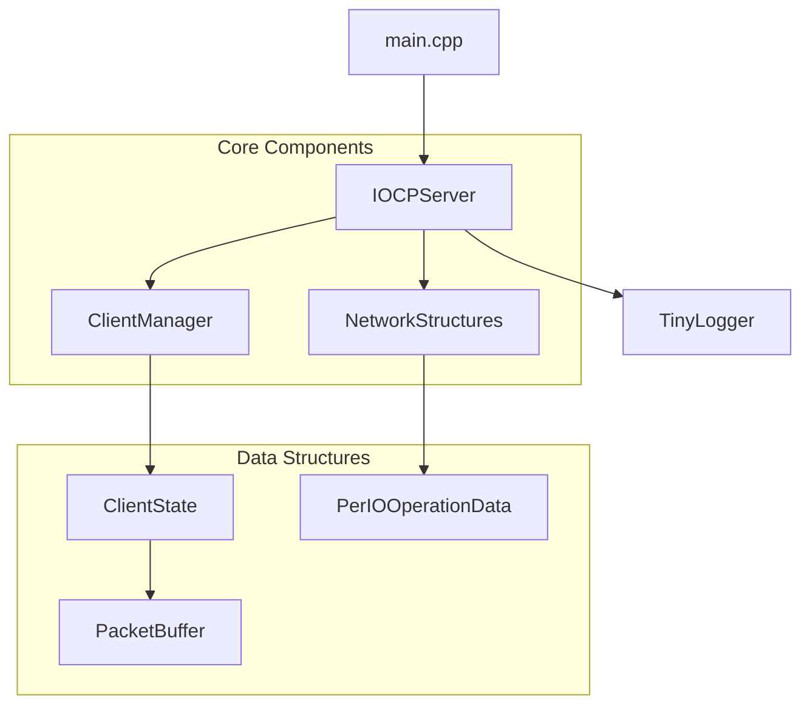
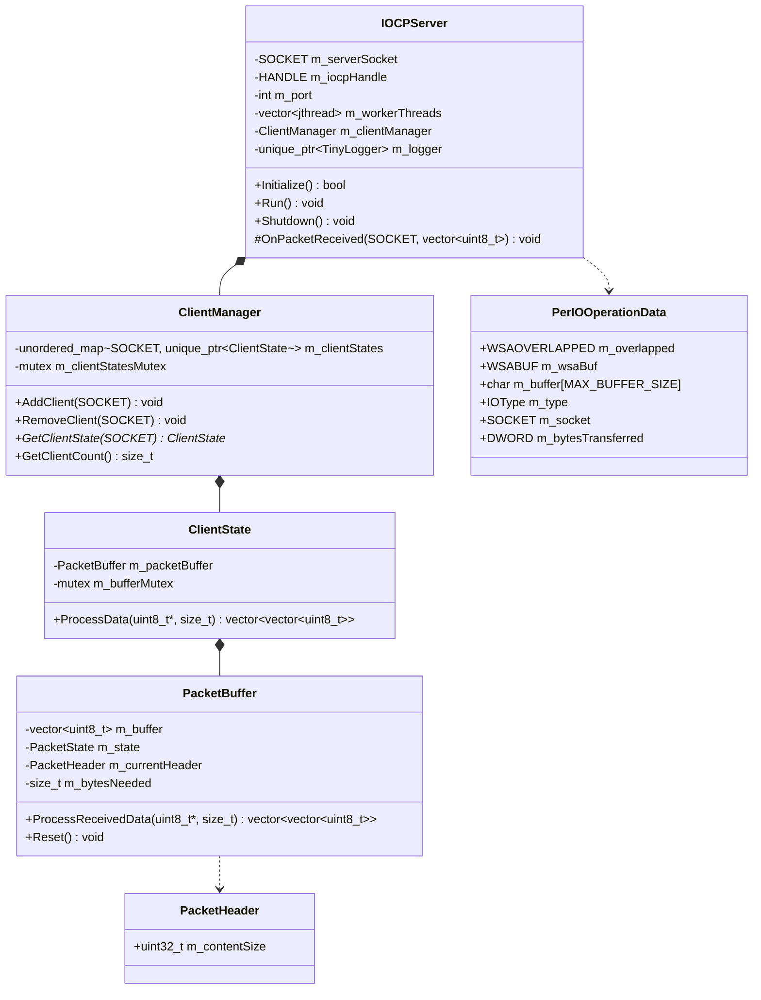
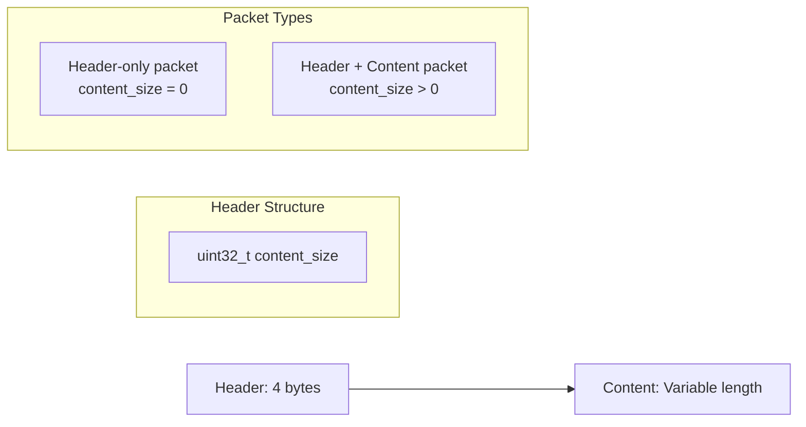
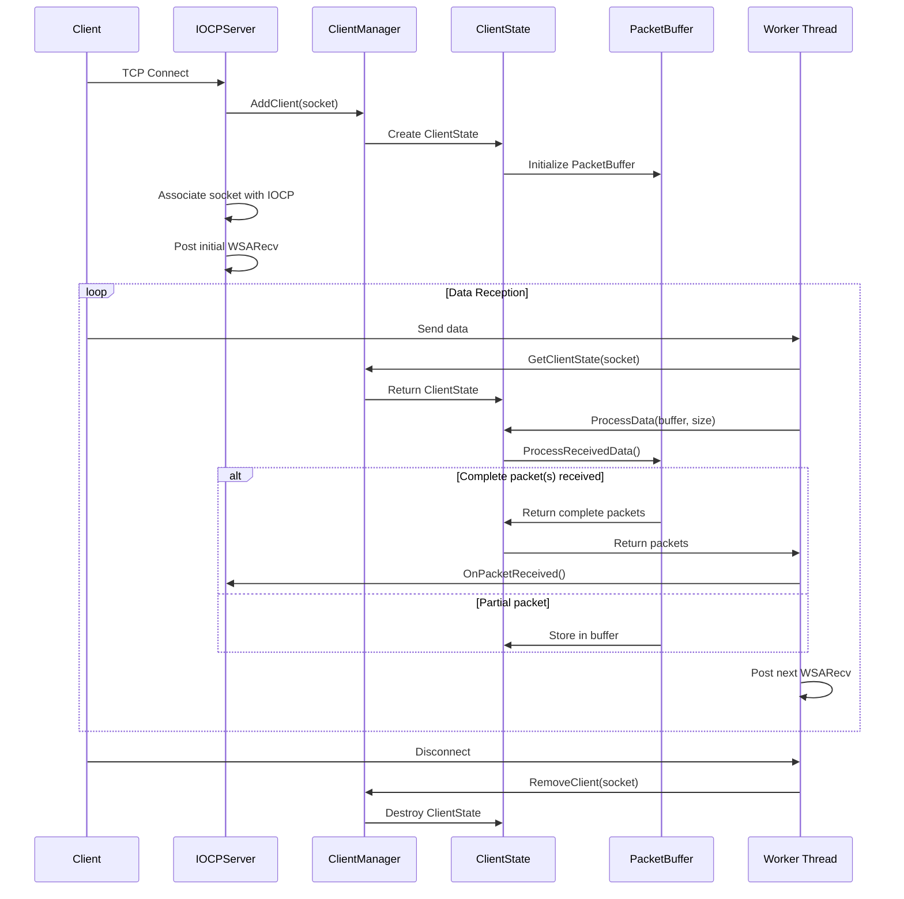
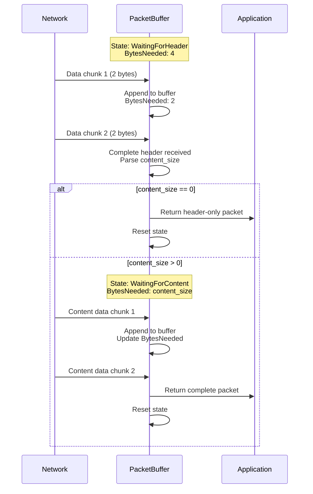
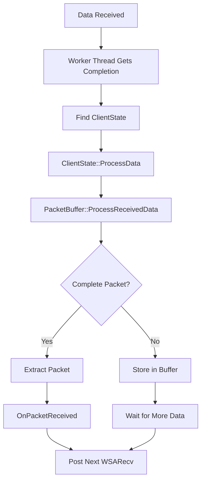

# IOCP TCP Server

A modern C++ implementation of a high-performance TCP server using Windows I/O Completion Ports (IOCP) with proper packet protocol handling and message reassembly.

## Features

- **High Performance**: Uses Windows IOCP for scalable asynchronous I/O operations
- **Packet Protocol**: Implements header-based packet protocol with automatic message reassembly
- **Thread Safe**: Multi-threaded design with proper synchronization
- **Modern C++**: Follows C++23 best practices with RAII, smart pointers, and clean interfaces
- **Extensible**: Object-oriented design allows easy customization and extension
- **Robust Error Handling**: Comprehensive error handling and graceful shutdown

## Architecture Overview

The server is built with a modular architecture consisting of several key components:



## Class Diagram



## Packet Protocol

The server implements a simple but robust packet protocol:



### Packet Format
- **Header**: 4 bytes containing the content size (uint32_t)
- **Content**: Variable length data (can be 0 for header-only packets)

## Sequence Diagram - Client Connection and Data Processing



## Sequence Diagram - Packet Reassembly Process



## How It Works

### 1. Server Initialization
```cpp
IOCPServer server(60000);  // Port 60000
if (!server.Initialize()) {
    // Handle initialization failure
}
```

The initialization process:
1. Sets up Winsock
2. Creates server socket with `WSA_FLAG_OVERLAPPED`
3. Binds to specified port
4. Creates IOCP handle
5. Starts worker threads

### 2. Client Connection Handling
When a client connects:
1. `accept()` creates a new client socket
2. Client state is created and added to `ClientManager`
3. Socket is associated with IOCP
4. Initial `WSARecv` operation is posted

### 3. Data Processing Pipeline



### 4. Packet Reassembly
The `PacketBuffer` class handles partial message reassembly:

```cpp
enum class PacketState {
    WaitingForHeader,    // Need 4 bytes for header
    WaitingForContent    // Need content_size bytes
};
```

**State Machine:**
1. **WaitingForHeader**: Accumulate data until we have 4 bytes
2. Parse header to get content size
3. If content_size == 0: Return header-only packet
4. If content_size > 0: Switch to **WaitingForContent**
5. **WaitingForContent**: Accumulate data until we have content_size bytes
6. Return complete packet and reset to **WaitingForHeader**

### 5. Thread Safety
- `ClientManager` uses mutex for thread-safe client state access
- Each `ClientState` has its own mutex for buffer operations
- IOCP handles thread synchronization for I/O operations
- Smart pointers ensure proper memory management

## Usage Example

### Basic Server
```cpp
#include "IOCPServer.h"

int main() {
    IOCPServer server(60000);
    
    if (!server.Initialize()) {
        return 1;
    }
    
    server.Run();  // Blocks until shutdown
    return 0;
}
```

### Custom Server with Packet Processing
```cpp
class MyServer : public IOCPServer {
public:
    explicit MyServer(int port) : IOCPServer(port) {}

protected:
    void OnPacketReceived(SOCKET clientSocket, 
                         const std::vector<uint8_t>& packet) override {
        // Parse packet header
        if (packet.size() >= sizeof(PacketHeader)) {
            PacketHeader header;
            std::memcpy(&header, packet.data(), sizeof(PacketHeader));
            
            // Process based on content
            if (header.m_contentSize > 0) {
                const uint8_t* content = packet.data() + sizeof(PacketHeader);
                ProcessContent(clientSocket, content, header.m_contentSize);
            } else {
                ProcessHeaderOnly(clientSocket);
            }
        }
    }
    
private:
    void ProcessContent(SOCKET socket, const uint8_t* data, size_t size) {
        // Handle packet with content
    }
    
    void ProcessHeaderOnly(SOCKET socket) {
        // Handle header-only packet (e.g., ping/keepalive)
    }
};
```

## Building

### Prerequisites
- Windows 10/11
- Visual Studio 2022 or later
- C++23 support

### Compilation
```cpp
// Required libraries
#pragma comment(lib, "ws2_32.lib")
```

### File Structure
```
project/
├── Common.h/cpp          # Common definitions and globals
├── NetworkStructures.h/cpp # Network data structures
├── ClientManager.h/cpp   # Client state management
├── IOCPServer.h/cpp     # Main server implementation
├── main.cpp             # Application entry point
└── tinyLogger.h         # Logging utility (external)
```

## Configuration

### Constants (Common.h)
```cpp
constexpr int DEFAULT_PORT = 60000;
constexpr int MAX_BUFFER_SIZE = 1024;
constexpr int LISTEN_BACKLOG = 200;
constexpr int DEFAULT_WORKER_THREADS = 4;
constexpr size_t PACKET_HEADER_SIZE = sizeof(uint32_t);
```

### Worker Threads
The server automatically creates worker threads equal to the number of CPU cores, but you can specify a custom count:

```cpp
IOCPServer server(60000, 8);  // Port 60000, 8 worker threads
```

## Error Handling

The server includes comprehensive error handling:
- Network errors (connection drops, timeouts)
- Protocol errors (malformed packets)
- Resource exhaustion
- Graceful shutdown on signals (SIGINT, SIGTERM)

## Performance Considerations

1. **IOCP Scalability**: Can handle thousands of concurrent connections
2. **Zero-Copy Operations**: Minimal data copying in packet processing
3. **Thread Pool**: Fixed number of worker threads prevents thread thrashing
4. **Memory Management**: Smart pointers and RAII prevent memory leaks
5. **Lock Contention**: Minimal locking with per-client state isolation

## Extension Points

The server is designed for easy extension:

1. **Custom Packet Types**: Override `OnPacketReceived()`
2. **Protocol Changes**: Modify `PacketHeader` and `PacketBuffer`
3. **Authentication**: Add authentication in connection handling
4. **SSL/TLS**: Wrap socket operations with SSL
5. **Load Balancing**: Add connection distribution logic

This architecture provides a solid foundation for building high-performance networked applications on Windows.