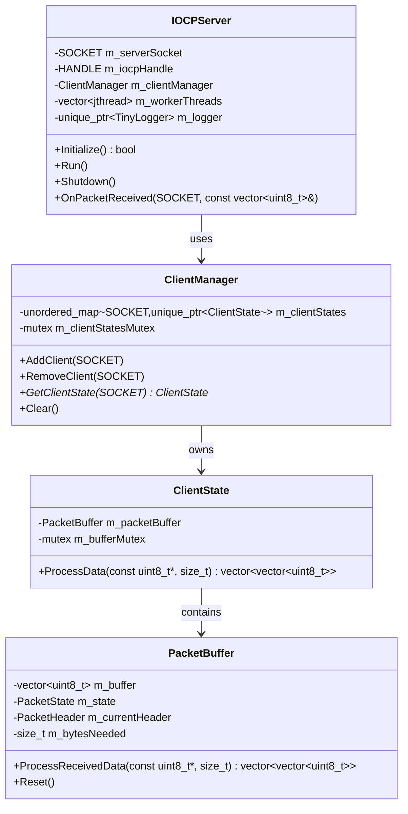
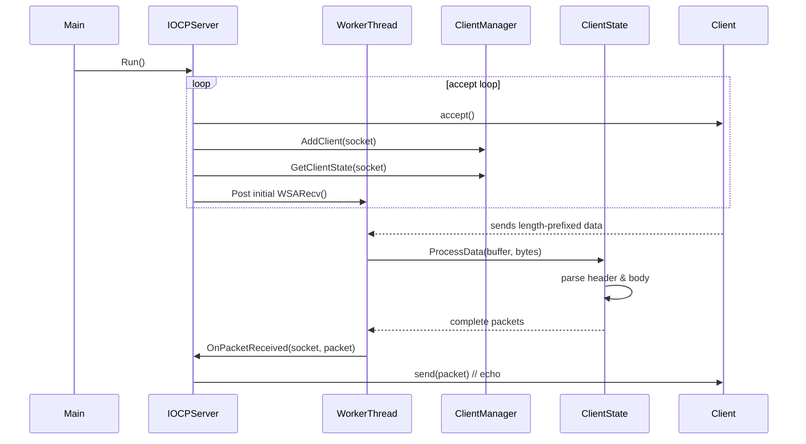

# IOCP Echo Server – README

A minimal, high-performance Windows-overlapped I/O echo server built with IOCP (Input/Output Completion Port), C++17 and Winsock.
It accepts many concurrent TCP connections, parses length-prefixed binary packets and (by default) echoes every received packet back to the sender.
The project is deliberately small and self-contained; extend OnPacketReceived() to turn it into a game server, chat back-end, etc.

---

## Features
- IOCP – scales to thousands of connections with a fixed-size thread pool.
- Length-prefixed protocol – each message is preceded by a 4-byte little-endian length field.
- Thread-safe client management – lock-free access from worker threads via ClientManager.
- Graceful shutdown – handles SIGINT/SIGTERM, closes sockets and joins worker threads.
- Extensible – override OnPacketReceived() for custom logic.

---
## Build
```sh
mkdir build && cd build
cmake .. -G "Visual Studio 17 2022"
cmake --build . --config Release
```

Run:
```sh
.\dist\iocp_server.exe
```

---
## Architecture Overview

Class Diagram


### Packet Format

| 4 bytes (little-endian) | N bytes |
| ----------------------- | ------- |
| Content-Length          | Payload |


---
## Runtime Flow
Sequence Diagram


---

- Main thread
  - accept() loop, adds new sockets to IOCP.
- Worker threads (N = CPU cores)
  - Block on GetQueuedCompletionStatus().
  - Parse packets (ClientState::ProcessData).
  - Invoke OnPacketReceived() (user code).
  - Re-post WSARecv() for next chunk.
  
All shared data (ClientManager, ClientState) is protected by std::mutex with minimal lock contention.

---
## Extending the Server

Derive from IOCPServer and override OnPacketReceived():

```cpp
class ChatServer : public IOCPServer {
protected:
    void OnPacketReceived(SOCKET client, const std::vector<uint8_t>& pkt) override {
        // broadcast to all other clients
        for (auto [sock, _] : m_clientManager) {
            if (sock != client) send(sock, pkt);
        }
    }
};
```

---

## logging

Logs are written to server-log.txt via the bundled `tinyLogger`.

Levels: INFO, WARN, ERR.

---
## Shutdown Handling
- `SIGINT/SIGTERM` sets `g_running = false`.
- Main loop exits → `accept()` returns `INVALID_SOCKET`.
- Worker threads time-out, notice `!g_running`, exit gracefully.
- All sockets closed, resources released.
